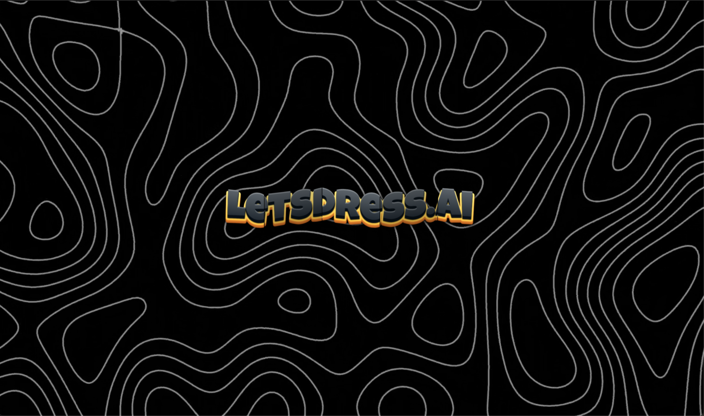
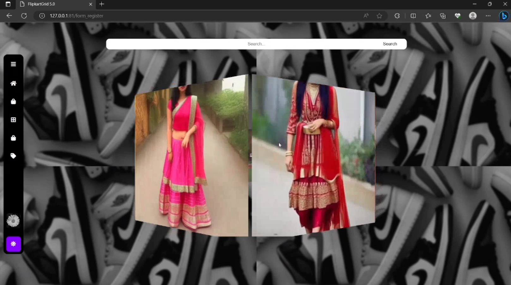

# 👗 Letsdress.AI – AI-Powered Fashion Personalization Tool

**Letsdress.AI** is a fashion-enhancement AI tool that recommends personalized clothing styles using image generation and prompt-based interaction. It combines the power of Stable Diffusion with a clean, modern UI for an intuitive user experience.

---

## 📌 Overview

Letsdress.AI helps users visualize personalized fashion recommendations by offering:

* 🧠 **Smart Recommendations** based on user input and style prompts
* 🔁 **Real-Time Trend Adaptation** that reflects the latest fashion trends
* 💻 **Modern UI/UX** with interactive and responsive design

---

## 📁 Project Structure

```
Letsdress.AI/
├── authtoken.py                  # App entry point and API auth logic
├── requirements.txt             # Python dependencies
├── *.png                        # Screenshot assets
│
├── database/
│   ├── image_data.py           # DB script for storing images and metadata
│   └── Image_data.db           # SQLite database
│
├── static/                     # Static frontend files
│   ├── css/
│   ├── js/
│   └── images/
│
├── templates/                  # HTML templates (Jinja2)
│   ├── feedback.html
│   ├── index.html
│   └── opening.html
│
├── .idea/                      # IDE (PyCharm) configs [optional, can ignore]
└── __pycache__/                # Python bytecode cache [auto-generated]
```

---

## 🧠 Features

* 👤 **User Personalization**: Tailors results to user prompts
* 🛍️ **Outfit Generation**: Uses Stable Diffusion for realistic clothing previews
* 📈 **Trend-Aware Filtering**: Highlights trending styles
* 💅 **Clean UI**: Minimal, modern, and user-friendly
* 📊 **Database Storage**: Saves generated images with prompt tags

---

## 🧰 Tech Stack

| Frontend        | Backend | Machine Learning         | Database |
| --------------- | ------- | ------------------------ | -------- |
| HTML / CSS / JS | Flask   | Stable Diffusion, Jinja2 | SQLite3  |

---

## 🔄 How It Works

1. **User Prompt**: Users input a desired clothing style
2. **Image Generation**: Prompt sent to the backend → Stable Diffusion generates visuals
3. **Storage**: Images saved in `static/images/` and logged in SQLite DB
4. **Display**: Results rendered dynamically on the web UI

---

## 🛠️ Getting Started

### 1. Clone the Repo

```bash
git clone https://github.com/agrawal-2005/Letsdress.AI.git
cd Letsdress.AI
```

### 2. Set Up the Environment

```bash
python -m venv venv
source venv/bin/activate  # Windows: venv\Scripts\activate
```

### 3. Install Dependencies

```bash
pip install -r requirements.txt
```

### 4. Add API Credentials

Create a `.env` file in the root directory:

```env
API_URL=https://router.huggingface.co/hf-inference/models/stabilityai/stable-diffusion-xl-base-1.0
API_TOKEN=your_huggingface_token_here
GMAIL=your_email_here
GMAIL_PASSWORD=your_gmail_app_password_here
```

### 5. Run the App

```bash
python authtoken.py
```

Visit: `http://localhost:5000`

---

## 🧬 Machine Learning

* Powered by **Stable Diffusion XL**
* Prompt-based generation: `"<style> outfit"` patterns
* Images rendered and saved for future display + analytics
* Supports basic trend personalization via text prompts

---

## 📸 Screenshots

| Startup Page                 | Results                                         |
| ---------------------------- | ----------------------------------------------- |
|  |   |

---

## 🙋 Feedback

Found an issue or have an idea?
Reach out via GitHub: [@agrawal-2005](https://github.com/agrawal-2005)

---

## 📄 License

MIT License — See [LICENSE](LICENSE) for details.